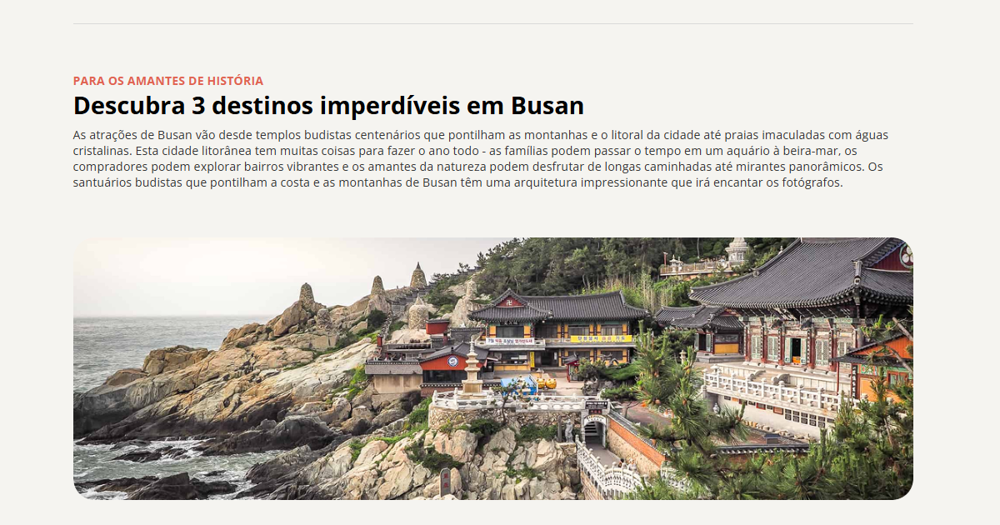

<h1 align="center"> Parque Yongdusan </h1>

Projeto prático para feito para estudos. Feito para poder práticar HTML e CSS.

  <a href="#-tecnologias">Tecnologias</a>&nbsp;&nbsp;&nbsp;|&nbsp;&nbsp;&nbsp;
  <a href="#-projeto">Projeto</a>&nbsp;&nbsp;&nbsp;|&nbsp;&nbsp;&nbsp;
  <a href="#-layout">Layout</a>&nbsp;&nbsp;&nbsp;|&nbsp;&nbsp;&nbsp;
  <a href="#memo-licença">Licença</a>

  

 

  

## 🚀 Tecnologias

Esse projeto foi desenvolvido com as seguintes tecnologias:

- HTML e CSS
- Git e Github
- Figma

## 💻 Projeto

O site "Sua próxima viagem: Conheça Busan" é uma página estática desenvolvida com HTML e CSS que apresenta, de forma elegante e informativa, três pontos turísticos imperdíveis da cidade de Busan, na Coreia do Sul. Com um visual moderno, uso de tipografia refinada e ícones personalizados, o projeto oferece uma ótima experiência de navegação e serve como prática de construção de layouts atrativos e bem estruturados para quem está se desenvolvendo no front-end.

## 🧾 Licença

Esse projeto está sob a licença MIT.

---

Feito com ♥ by Lincoln Santos
